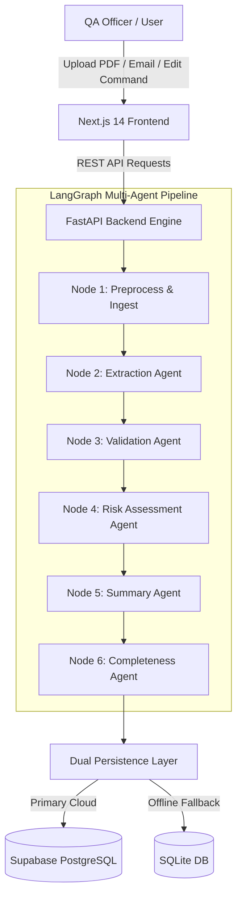

# 🔬 Pharma Complaint AI — Customer Complaint Management System (QCMS)

> **Enterprise-Grade AI-Powered Quality Assurance Module for Pharmaceutical Manufacturing (API & FDF)**

[](https://nextjs.org/)
[](https://fastapi.tiangolo.com/)
[](https://langchain-ai.github.io/langgraph/)
[](https://groq.com/)
[](https://supabase.com/)
[](https://www.typescriptlang.org/)

---

## 📌 Executive Overview

**Pharma Complaint AI** is a production-ready, enterprise-grade frontend and backend application built to automate and accelerate customer complaint intake, risk classification, and quality investigation for pharmaceutical active pharmaceutical ingredients (API) and finished dosage forms (FDF).

Leveraging a **stateful multi-agent LangGraph workflow engine** powered by **Groq LLM (`llama-3.3-70b-versatile`)** and a **dual-persistence storage architecture (Supabase PostgreSQL + SQLite)**, the system transforms unstructured complaint documents (PDF, DOCX, EML, TXT) into structured QMS records in seconds.

---

## ✨ Key Features & Capabilities

### 1. ⚡ Automated AI Document Extraction (9-Step Pipeline)
- **Multi-Format Ingestion**: Supports PDF lab reports, Word documents, email statements, and raw text.
- **13 Mandatory QMS Fields**: Automatically extracts customer details, product name, grade/strength, batch number, manufacturing date, expiry date, quantity affected, complaint type, date, description, severity, and priority.
- **Confidence Scoring**: Evaluates extraction confidence ($>95\%$ auto-populated) with clear visual field highlighting until manually edited.

### 2. 🛡️ Explainable AI Risk Assessment
- **Multi-Factor Risk Model**: Assigns Risk Levels (`Critical`, `High`, `Medium`, `Low`) based on physical attribute deviations, batch scale impact, formulation category, and storage compliance.
- **Explainability**: Displays top contributing factor impact chips (`HIGH/MEDIUM/LOW`), confidence meters, reasoning bullets, and recommended SOP investigation steps under GMP Annex 16 guidelines.

### 3. 💬 Dual-Mode AI Chat & Natural Language Editing Assistant
- **Mode 1 — QA Querying**: Answers questions conversationally (*"Why is this High Risk?"*, *"Summarize this complaint"*, *"What information is missing?"*).
- **Mode 2 — Natural Language Complaint Editing**: Understands user edit commands (*"Change batch number to AMX-2026-B099"*, *"Set quantity affected to 500 units"*), updates only target fields, preserves 100% of all other complaint data, and automatically triggers LangGraph re-evaluation of Risk, Executive Summary, and Completeness.

### 4. 🗄️ Dual-Persistence Architecture
- **Supabase PostgreSQL**: Enterprise cloud database for multi-tenant production storage (`complaints`, `activity_logs`, `chat_history`, `uploaded_documents`).
- **Local SQLite Fallback (`qcms.db`)**: Automatic persistent fallback ensuring 100% data persistence across server restarts even without external credentials.

### 📋 Enterprise QMS Validation Gate
- Validates 7 mandatory quality rules prior to saving to prevent incomplete submission.

---

## 🏗️ System Architecture



---

## 🛠️ Technology Stack

| Layer | Technologies Used |
|---|---|
| **Frontend Framework** | **Next.js 14 (App Router)**, React 18, TypeScript |
| **State Management** | **Redux Toolkit (`@reduxjs/toolkit`)**, React-Redux |
| **Styling & Design System** | Vanilla CSS Modules, CSS Tokens, Inter Font, Glassmorphism, Responsive 2-Column Layout |
| **Icons & UI Utilities** | Lucide React, Custom Skeletons, Animated Timelines |
| **Backend Framework** | **FastAPI 0.110**, Uvicorn ASGI Server, Pydantic v2 |
| **AI Orchestration** | **LangGraph (`langgraph.graph.StateGraph`)**, LangChain Core |
| **LLM Provider** | **Groq API** (`llama-3.3-70b-versatile` / `llama-3.1-8b-instant`) |
| **Document Processing** | PyPDF, Python-Multipart |
| **Database & Persistence** | **Supabase PostgreSQL**, SQLite (`sqlite3`), Pydantic BaseSettings |

---

## 📂 Project Structure

```
QCMS/
├── backend/
│   ├── app/
│   │   ├── api/
│   │   │   └── endpoints/
│   │   │       ├── chat.py             # Dual-Mode Chat & Editing Agent API
│   │   │       └── complaints.py       # Extraction, Validation, Save & List APIs
│   │   ├── graph/
│   │   │   ├── nodes.py            # LangGraph Agent Nodes (Extract, Risk, Summary, Completeness)
│   │   │   ├── state.py            # GraphState TypedDict Definition
│   │   │   └── workflow.py         # StateGraph Workflow Compiler
│   │   ├── prompts/
│   │   │   ├── extract_v1.py       # System Prompts for Extraction
│   │   │   ├── risk_v1.py          # System Prompts for Risk Classification
│   │   │   ├── edit_v1.py          # System Prompts for AI Editing Agent
│   │   │   └── summary_v1.py       # System Prompts for Summary Generation
│   │   ├── schemas/                # Pydantic Request & Response Schemas
│   │   ├── services/
│   │   │   ├── document_parser.py  # PyPDF Document Parsing
│   │   │   ├── llm_service.py      # Groq LLM Invocations & SSL Handling
│   │   │   └── supabase_service.py # Dual-Persistence Engine (Supabase + SQLite)
│   │   ├── config.py               # Environment Configuration
│   │   └── main.py                 # FastAPI Application Entrypoint
│   ├── .env.example                # Backend Environment Template
│   ├── requirements.txt            # Python Dependencies
│   └── supabase_schema.sql         # Supabase PostgreSQL DDL Script
│
├── src/
│   ├── app/                        # Next.js 14 App Router (layout, page, providers)
│   ├── data/                       # Initial Redux Data & Dropdown Configs
│   ├── features/
│   │   ├── ai-assistant/           # Upload, 9-Step Timeline, Risk Card, Completeness
│   │   ├── chat/                   # AI Chat Assistant (QA & Editing Modes)
│   │   └── complaint/              # Form Sections, Timeline, Validation Gate
│   ├── services/
│   │   └── apiClient.ts            # Frontend API Client connecting to FastAPI
│   ├── shared/                     # Header, FormField, Badge, Button, Alert
│   ├── store/                      # Redux Toolkit Slices (complaint, aiAssistant, chat)
│   ├── types/                      # TypeScript Interfaces
│   └── utils/                      # Formatting Helpers
└── README.md
```

---

## 🚀 Quick Start & Installation

### Prerequisites
- **Node.js**: `v18.0.0` or higher
- **Python**: `v3.10` or `v3.11`
- **Groq API Key**: Obtain a key from [Groq Console](https://console.groq.com/)

---

### 1. Backend Setup (FastAPI)

```bash
# Navigate to backend directory
cd backend

# Create and activate virtual environment (optional)
python -m venv venv
# On Windows:
venv\Scripts\activate
# On macOS/Linux:
source venv/bin/activate

# Install dependencies
pip install -r requirements.txt

# Create environment configuration
cp .env.example .env
```

Edit `backend/.env` to include your Groq API Key:

```env
PORT=8000
HOST=0.0.0.0
ENVIRONMENT=development
GROQ_API_KEY=gsk_your_actual_groq_key_here
GROQ_MODEL=llama-3.3-70b-versatile
GROQ_FALLBACK_MODEL=llama-3.1-8b-instant

# Optional: Supabase PostgreSQL credentials
SUPABASE_URL=https://your-project.supabase.co
SUPABASE_SERVICE_ROLE_KEY=your_service_role_key
```

Start the FastAPI server:

```bash
python -m uvicorn app.main:app --host 0.0.0.0 --port 8000 --reload
```

Backend will be active at:
- **API Server**: `http://localhost:8000`
- **Swagger UI Docs**: `http://localhost:8000/docs`

---

### 2. Frontend Setup (Next.js 14)

In a new terminal window:

```bash
# Navigate to root directory
cd ..

# Install npm dependencies
npm install

# Start Next.js development server
npm run dev
```

Frontend application will be active at:
- **Dashboard UI**: `http://localhost:3000` (or `http://localhost:3001`)

---

## 📡 REST API Reference

### 1. Extract Complaint Document
```http
POST /api/v1/complaints/extract
Content-Type: multipart/form-data OR application/x-www-form-urlencoded
```
*Executes the 6-agent LangGraph workflow via Groq LLM to extract 13 QMS fields, calculate risk assessment, summary, and completeness.*

### 2. AI Chat & Natural Language Editing
```http
POST /api/v1/chat/message
Content-Type: application/json

{
  "query": "Change batch number to AMX-2026-B099",
  "complaint_context": { "batch_number": "AMX-2026-B047" },
  "risk_context": { "risk_level": "high" }
}
```
*Auto-detects intent (`qa` or `edit`). In `edit` mode, returns structured JSON patch, updates target fields, recalculates risk, and appends an activity timeline log.*

### 3. Save Complaint
```http
POST /api/v1/complaints/save
Content-Type: application/json
```
*Persists complete complaint record into Supabase PostgreSQL and local SQLite DB.*

### 4. List Saved Complaints
```http
GET /api/v1/complaints
```
*Retrieves all saved complaints from the database.*

---

## 🗄️ Database Setup (Supabase)

To configure Supabase PostgreSQL:
1. Create a new project in [Supabase](https://supabase.com/).
2. Navigate to **SQL Editor** and run the script in [`backend/supabase_schema.sql`](file:///c:/Users/manoj/Desktop/Project/QCMS/backend/supabase_schema.sql).
3. Copy your project URL and Service Role Key into `backend/.env`.

---

## 📄 License

Distributed under the MIT License. See `LICENSE` for more information.
